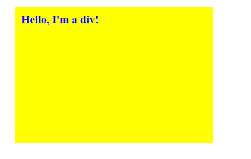

Project: DOM Manipulation

Overview
Welcome to my GitHub repository! Here, you will find a collection of my front-end projects, each demonstrating my skills in HTML, CSS, and JavaScript. Below is a summary of one of my recent projects where I implemented various DOM manipulation techniques.

Project Description
In this project, I created a simple web page where a div element's styles are dynamically changed using JavaScript. The main objective was to manipulate the DOM to alter the color, background color, margin, padding, font size, font weight, height, and width of the div element.

Key Features
- Consistent UI: Ensured the user interface remained consistent across all steps.
- Visual Appeal: Properly aligned elements to ensure a pleasant user experience.
- DOM Manipulation: Utilized getElementById to fetch the target div element and stored it in a variable for further manipulation.
- Styling with JavaScript: Applied various styles using the style property in JavaScript.

Detailed Instructions: 
UI Consistency and Alignment
- Ensured the UI remained consistent and elements were properly aligned.

Element Retrieval
- Used getElementById to retrieve the div element and stored it in a variable.

Background Color Change
- Changed the background color of the div element to yellow using style.backgroundColor.

Margin Addition
- Added a margin of 20 pixels to the element using style.margin.

Padding Application
- Applied a padding of 10 pixels using style.padding.

Font Size Change
- Changed the font size to 18 pixels using style.fontSize.

Font Weight Setting
- Set the font weight to bold using style.fontWeight.

Height Modification
- Changed the height of the element to 200 pixels using style.height.

Width Modification
- Modified the width of the element to 300 pixels using style.width.

My Work :- 
Hosted Version
- You can view the live version of the project [ https://ash-dot-coder.github.io/LIve-Class-Work/Live%20Class/Module-4/DOM/index.html ].

Output:

DOM Project
This project demonstrates basic manipulation of the DOM (Document Object Model) using JavaScript. It showcases how to access and modify HTML elements dynamically. Below is a brief description of what the code does:

Code Description:
1. HTML Structure:
    - A simple HTML document containing a `div` element with some initial inline styles.
    - The `div` has an ID of `myDiv`, which is used to reference the element in JavaScript.
2. JavaScript:
    - The JavaScript code accesses the `div` element using document.`getElementById`.
    - It then changes various styles of the `div` element, such as text color, background color, margin, padding, font size, font weight, height, and width.

Key Features:
    - Dynamic Style Manipulation: Demonstrates how to dynamically change the styles of an HTML element using        JavaScript.
    - DOM Access: Shows how to access an HTML element by its ID.
    Inline Styling: The initial styles are set inline within the `div` element for demonstration purposes.

Usage:
- To view this project, simply open the HTML file in a web browser. The JavaScript code will execute automatically, applying the specified styles to the `div` element.

